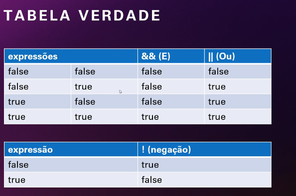

# estudos

estudos na nuvem

1° add . ( O PONTO ADD TUDO!) ou ADD "Nome do Arquivo" (disclame ou é o . ou Nome do arquivo)

pos add fazer o commit ou embalar

2° git commit -m "Mensagem do que foi alterado no commit"

3° git push (envia todos os commits)

-------------//-------------

git pull (puxa os alterações do github)

git status (ver status)

cls (LIMPA O TERMINAL)

